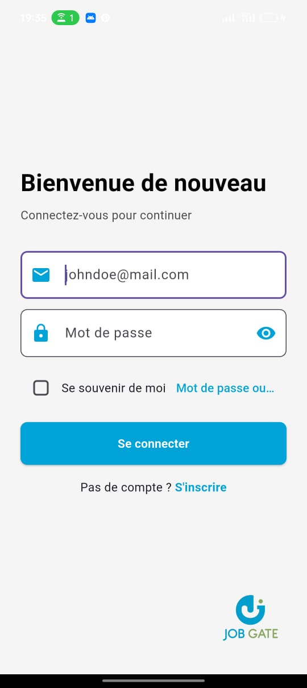
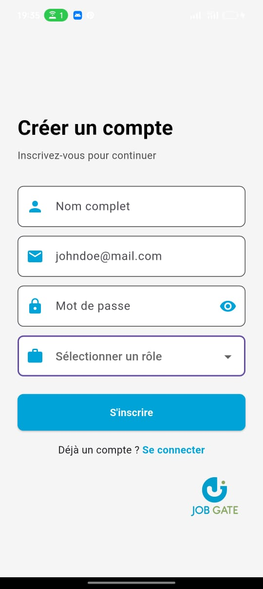
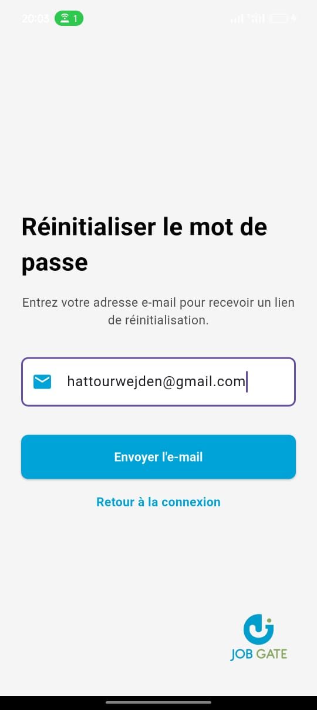
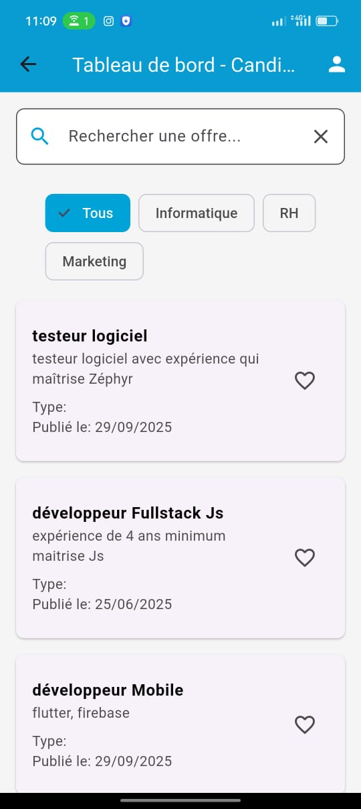
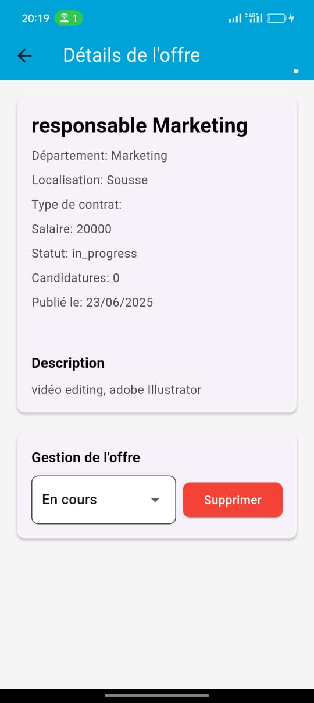
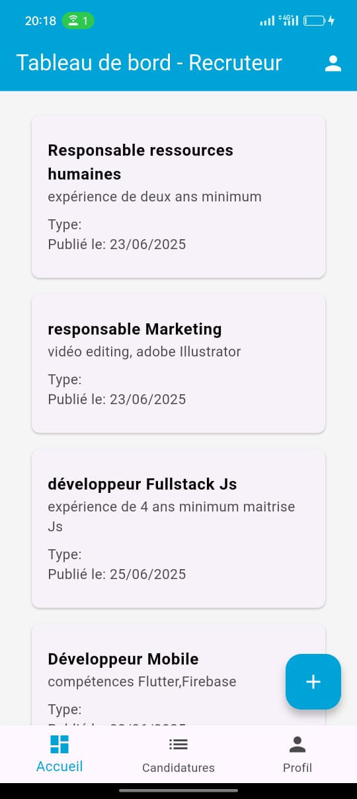
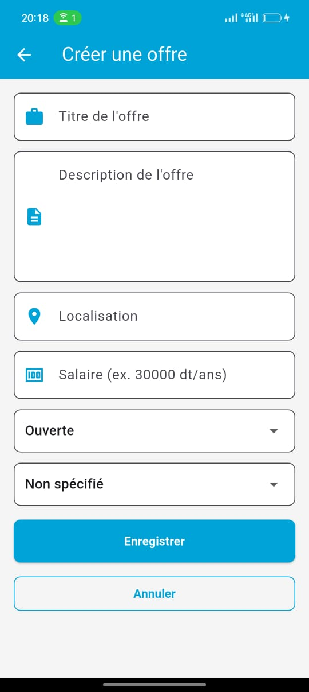
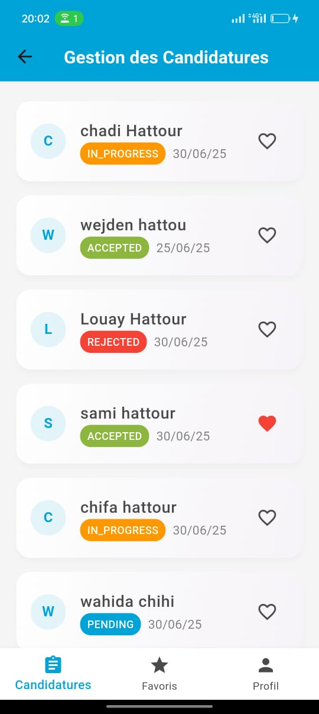
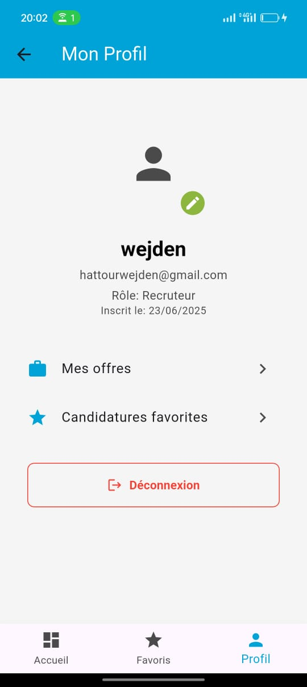

# CandidApp

Welcome to **CandidApp**, a Flutter-based mobile application designed to facilitate job applications and management for candidates and recruiters. This app allows candidates to browse and favorite job offers, while recruiters can manage job postings and applications.

## Overview

CandidApp is built using Flutter, with Firebase for authentication and Firestore for data management. It provides a user-friendly interface for:
- **Candidates**: View open job offers, filter by department, search, and manage favorites.
- **Recruiters**: Post job offers, manage applications, and view their dashboard.

The app leverages Riverpod for state management and follows a modular architecture with separate screens for candidates and recruiters.

## Features

- **Candidate Features**:
  - Browse and filter open job offers by department (e.g., Informatics, HR, Marketing).
  - Search job offers by title or description.
  - Add or remove job offers from favorites.
  - Navigate to job details for more information.
- **Recruiter Features**:
  - View and manage posted job offers.
  - Create new job offers.
  - Access application management.
- **Authentication**:
  - Secure login and role-based access using Firebase Authentication.
  - Redirects to appropriate dashboards based on user role (candidate or recruiter).
- **UI/UX**:
  - Responsive design with a bottom navigation bar.
  - Custom widgets for search, filters, and job cards.

## Screenshots

Here are some screenshots of CandidApp in action, divided by interface type:

## Screenshots

Here are some screenshots of CandidApp in action, divided by interface type:

### Common Interfaces
| **Screen**          | **Preview**                                      |
|---------------------|--------------------------------------------------|
| Login Screen        |     |
| Signup Screen       |   |
| Forgot Password     |  |

### Candidate Interfaces
| **Screen**            | **Preview**                                      |
|-----------------------|--------------------------------------------------|
| Candidate Dashboard   |  |
| Job Detail Screen     |  |
| Candidate Profile Screen    |  |

### Recruiter Interfaces
| **Screen**            | **Preview**                                      |
|-----------------------|--------------------------------------------------|
| Recruiter Dashboard   |  |
| Create Offer Screen   |  |
| Applications Management |  |
| Recruiter Favorite Screen |  |
| Recruiter Profile Screen    |  |


## Prerequisites

- **Flutter SDK**: Ensure Flutter is installed (version 3.x recommended). Check with `flutter --version`.
- **Dart**: Included with Flutter.
- **Firebase**:
  - A Firebase project with Firestore, Authentication, and the necessary configuration files (`google-services.json` for Android, `GoogleService-Info.plist` for iOS).
- **IDE**: Visual Studio Code or Android Studio with Flutter plugins.
- **Node.js** (optional): For Firebase CLI if managing Firebase rules or deployment.

## Installation

**Clone the Repository**:
   ```bash
   git clone https://github.com/your-username/candidapp.git
   cd candidapp

